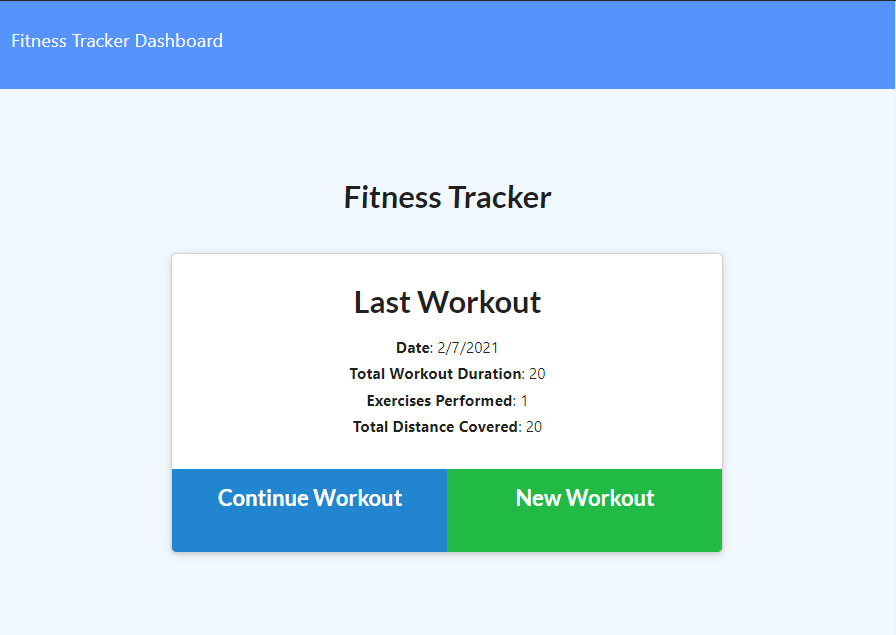

# Workout Tracker
## Description
Allows user to enter exercises for a new workout or add exercises to a current workout. Application utilizes a Mongo Database, Mongoose, and Express.  HTML and API routes were created to handle all UI and database functions.
## Table of Contents
- [Installation](#installation)
- [Usage](#usage)
- [Contributing](#contributing)
- [Tests](#tests)
- [License](#license)
- [Questions](#questions)
- [Screenshot](#screenshot)
- [Deployed-App](#deployed-app)
## Installation
Clone from GitHub and then "npm i"
## Usage
To start - "node server.js" in the Develop directory
## Contributing
None
## Tests
None
## License
The_Unlicense

For information on this license, please follow [this link](https://choosealicense.com/licenses/unlicense/)
## Questions
Contact the author with questions via GitHub or email at

[JonPointer at GitHub](https://github.com/JonPointer) jonpointer@msn.com
## Screenshot

## Deployed-App
[Deployed App on Heroku](https://tranquil-bastion-69503.herokuapp.com/)